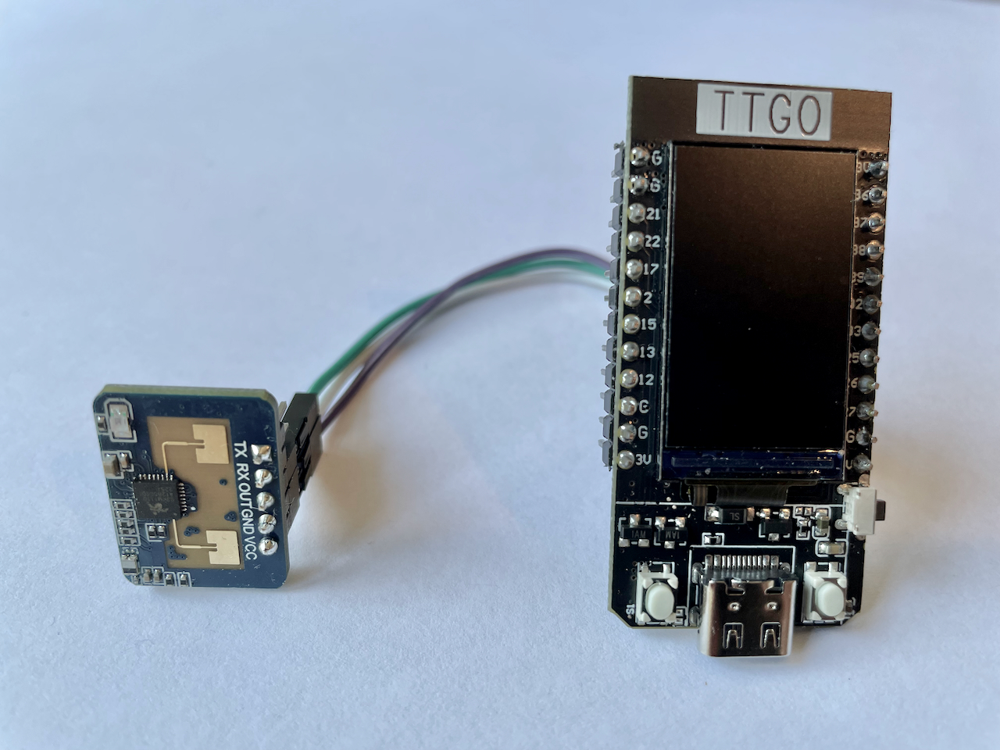
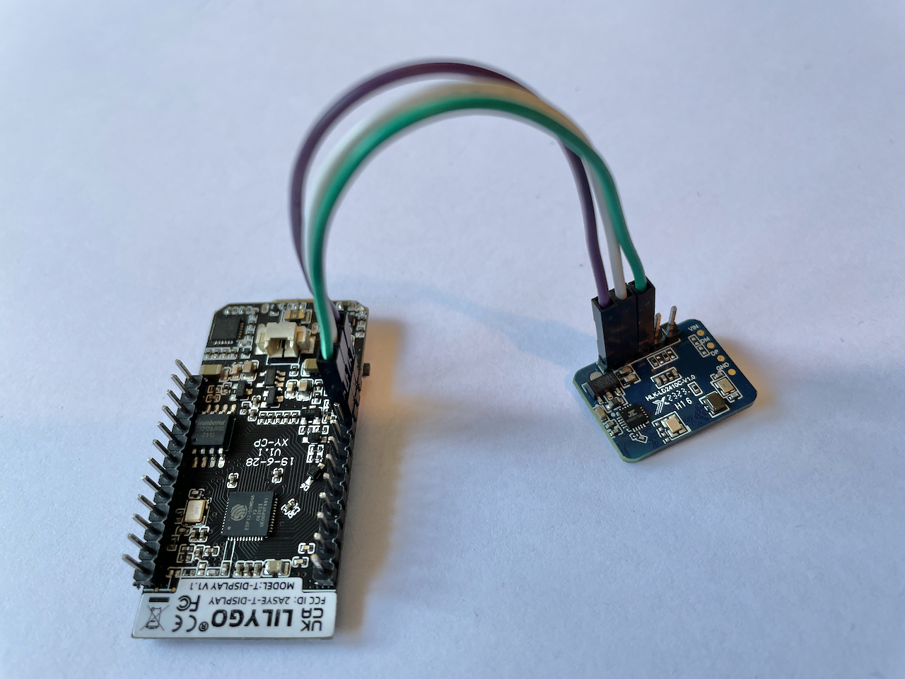
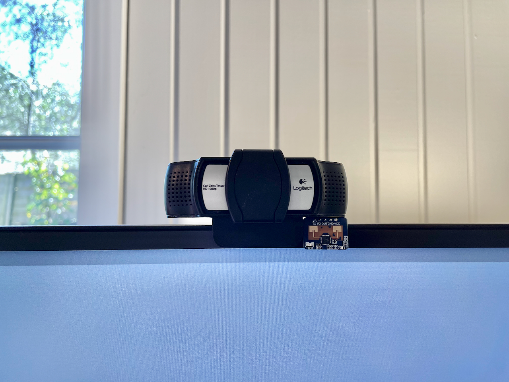

## Overview

This project turns office lights on and off based on human presence.

- A mmWave sensor is used to detect presence.
- The ESP32 has a small LCD display to show changes in state. After 5 seconds of no changes, it will show the current time.
- The ESP32 communicates with [Home Assistant](https://www.home-assistant.io/) via REST API to turn the lights on and off.

ESP32 with mmWave Sensor:

Current Placement:

## Hardware Used

- LILYGO TTGO T-Display ESP32
- HLK-LD2410C 24G Intelligent MMwave Sensor Switch

## Setup

### Hardware

Solder the header pins to the ESP32 and connect the mmWave sensor.

| ESP32                  | LD2410C |
| ---------------------- | ------- |
| 5V                     | VCC     |
| GND                    | GND     |
| GPIO 27 (Configurable) | OUT     |

The sensitivity of the mmWave sensor can be configured over bluetooth by using the [HLKRadarTool](https://apps.apple.com/us/app/hlkradartool/id1638651152) app.

### Home Assistant

1.  Create 2 [Home Assistant webhooks](https://developers.home-assistant.io/docs/en/external_api_rest.html#webhook).
    1.  One for turning the light on and one for turning the light off.
    1.  The webhook URLs should be `http://<IP_ADDRESS>/webhook/<WEBHOOK_ID>`.
    1.  Take note of the webhook IDs - these will be added to the config.
1.  Create a [long lived access token in Home Assistant](https://developers.home-assistant.io/docs/auth_api/#long-lived-access-token).
    1.  Take note of the token - this will be added to the config.

### Software

1. Install the [platformio VSCode extension](https://marketplace.visualstudio.com/items?itemName=platformio.platformio-ide).
2. Update the config.
   1. Rename `config.example.h` to `config.h`.
   1. Update the values.
3. Update the TFT settings in `platformio.ini`.
4. Build and upload the code to the ESP32.
   1. Connect the ESP32 to your computer via USB.
   1. In VSCode, run the "PlatformIO: Upload" command.

## Future Improvements

- 3d print a case
- Send wake-on-lan packet to computer when presence is detected

## Thanks

Big thanks to David Zhang for the inspiration and initial implementation. His youtube channel is great and worth subscribing to.

- https://www.youtube.com/watch?v=76wAEJOdBq8
- https://github.com/davidz-yt/lg-oled-auto-sleep
